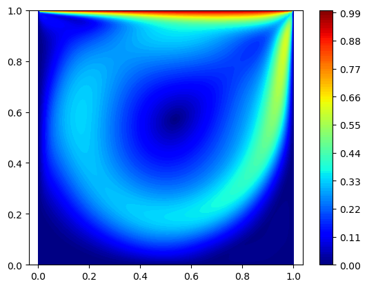
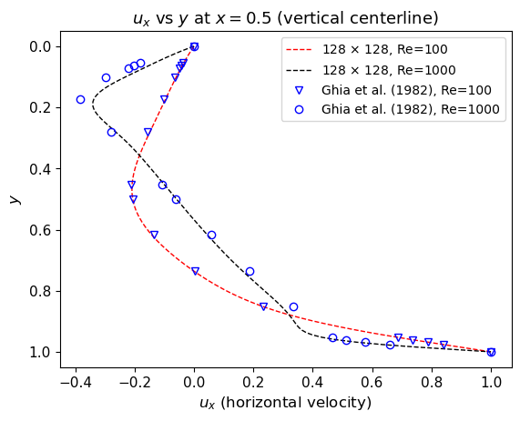
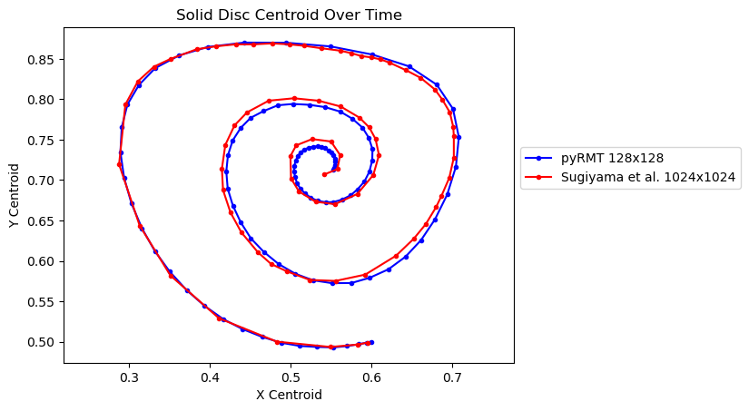

# pyRMT
pyRMT is a Python package for simulating Fluid-Structure Interaction (FSI) in 2D using the Reference Map Technique (RMT). It includes a set of benchmark problems to validate the accuracy of its methods. The main features of the formulation are:

- Discretization on a collocated grid
- Semi-Lagrangian advection of the reference map with RK4 integration
- Time integration of the velocity field using RK4
- 4th order central difference schemes for advective and diffusive terms
- Extrapolation-based extension of solid regions into the fluid for stress computation
- Level set reconstruction via the advected reference map
- Mild PDE-based reinitialization of the level set
- Multigrid solver for the Poisson pressure equation
- Nearly-incompressible formulation of Neo-Hookean solid

## Examples

### 1) Lid-driven Fluid flow
Verification of the fluid solver with lid-driven fluid flow:
|  |  |
|:---------------------------------------------------------------------------------------------:|:-------------------------------------------------------------------------------:|
| Lid Driven Cavity (Re=1000)                                                                   | Lid Driven Cavity                                                               |

### 2) Soft Disc in Lid driven flow
|  |  |
|:------------------------------------------------------------------------------------------:|:-----------------------------------------------------------------------------------------------:|
| Centroid Trajectory                                                                         | Simulation Animation                                                                            |

## License

This project is licensed under the MIT License.

## References
1. Suhas S. Jain, Ken Kamrin, Ali Mani, *A conservative and non-dissipative Eulerian formulation for the simulation of soft solids in fluids*, Journal
   of Computational Physics, **399**, 108922 (2019),
   [https://doi.org/10.1016/j.jcp.2019.108922](https://doi.org/10.1016/j.jcp.2019.108922)

4. Ken Kamrin, Chris H. Rycroft, and Jean-Christophe Nave, *Reference map
   technique for finite-strain elasticity and fluid–solid interaction*, Journal
   of the Mechanics and Physics of Solids **60**, 1952–1969 (2012).
   [doi:10.1016/j.jmps.2012.06.003](https://doi.org/10.1016/j.jmps.2012.06.003)

5. Boris Valkov, Chris H. Rycroft, and Ken Kamrin, *Eulerian method for
   multiphase interactions of soft solid bodies in fluids*, Journal of Applied
   Mechanics **82**, 041011 (2015).
   [doi:10.1115/1.4029765](https://doi.org/10.1115/1.4029765)
