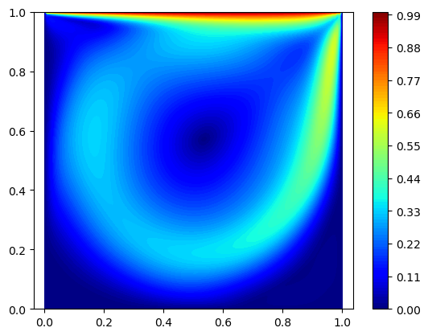
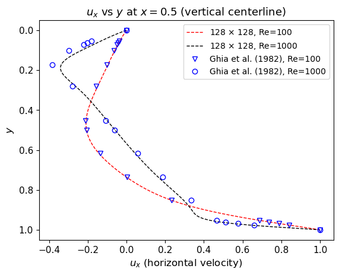
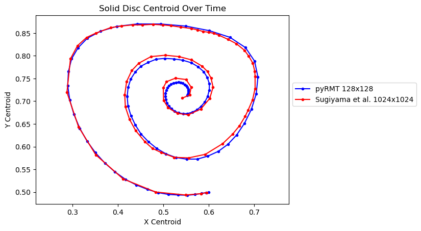

# pyRMT
pyRMT is a research Python code for simulating Fluid-Structure Interaction (FSI) in 2D using the Reference Map Technique (RMT). It includes a set of benchmark problems to validate the accuracy of its methods. The main methods and schemes used are:

- Discretization on a collocated grid
- Semi-Lagrangian advection of the reference map with RK4 integration
- Time integration of the velocity field using RK4
- 4th-order central difference schemes for advective, diffusive, and gradient terms
- Extrapolation-based extension of solid regions into the fluid for stress computation (layer-by-layer weighted least-squares plane fit)
- Level set reconstruction via the advected reference map
- PDE-based reinitialization of the level set (Sussman–Smereka–Osher upwind scheme)
- Algebraic Multigrid (AMG) solver via PyAMG for the Poisson pressure equation
- Rhie-Chow interpolation for pressure projection to suppress pressure–velocity decoupling
- Compressible Neo-Hookean solid with volumetric penalty term
- One-fluid blended velocity formulation: solid and fluid stresses combined through a smooth Heaviside function centered on the level set interface
- Optional viscous damping term in the solid (`eta_s`)
- Bilinear interpolation accelerated with Numba JIT compilation

## Installation

**Prerequisites:** Python 3.8+ with `numpy`, `scipy`, `matplotlib`, `h5py`, `pyamg`, and `numba`.

Clone the repository and install in editable mode:

```bash
git clone https://github.com/samanseifi/pyRMT.git
cd pyRMT
pip install -e .
```

Or install the dependencies directly:

```bash
pip install numpy scipy matplotlib h5py pyamg numba
```

## Quick Start

Two benchmark simulations are provided in the `benchmarks/` directory.

### Lid-driven cavity (pure fluid)

```bash
python benchmarks/lid_driven.py
```

Runs a lid-driven cavity flow at Re = 1000 on a 128×128 grid. Simulation output is written to `outputs/output_lid_driven_Re_1000_3/` as HDF5 files every 100 steps.

### Soft disc in lid-driven cavity (FSI)

```bash
python benchmarks/soft_disc_in_lid_driven.py
```

Runs a Neo-Hookean elastic disc (μ_s = 0.1, κ = 1.0) immersed in a lid-driven cavity on a 128×128 grid. Output is written to `outputs/output_lid_driven_soft_disc_2/`.

### Post-processing

Jupyter notebooks for visualisation and analysis are available in `notebooks/`:

| Notebook | Description |
|---|---|
| `centroid.ipynb` | Tracks the centroid trajectory of the solid disc over time |
| `plotting.ipynb` | Plots FSI simulation fields (velocity, pressure, level set, stresses) |
| `plotting_lid_driven.ipynb` | Plots and validates pure-fluid lid-driven cavity results |

## Examples

### 1) Lid-driven cavity flow
Verification of the fluid solver against benchmark data (Ghia et al.):
|  |  |
|:---------------------------------------------------------------------------------------------:|:-------------------------------------------------------------------------------:|
| Lid Driven Cavity (Re=1000)                                                                   | Lid Driven Cavity                                                               |

### 2) Soft disc in lid-driven cavity (FSI)
|  |  |
|:------------------------------------------------------------------------------------------:|:-----------------------------------------------------------------------------------------------:|
| Centroid Trajectory                                                                         | Simulation Animation                                                                            |

## License

This project is licensed under the MIT License.

## References
1. Suhas S. Jain, Ken Kamrin, Ali Mani, *A conservative and non-dissipative Eulerian formulation for the simulation of soft solids in fluids*, Journal
   of Computational Physics, **399**, 108922 (2019),
   [https://doi.org/10.1016/j.jcp.2019.108922](https://doi.org/10.1016/j.jcp.2019.108922)

2. Ken Kamrin, Chris H. Rycroft, and Jean-Christophe Nave, *Reference map
   technique for finite-strain elasticity and fluid–solid interaction*, Journal
   of the Mechanics and Physics of Solids **60**, 1952–1969 (2012).
   [doi:10.1016/j.jmps.2012.06.003](https://doi.org/10.1016/j.jmps.2012.06.003)

3. Boris Valkov, Chris H. Rycroft, and Ken Kamrin, *Eulerian method for
   multiphase interactions of soft solid bodies in fluids*, Journal of Applied
   Mechanics **82**, 041011 (2015).
   [doi:10.1115/1.4029765](https://doi.org/10.1115/1.4029765)
