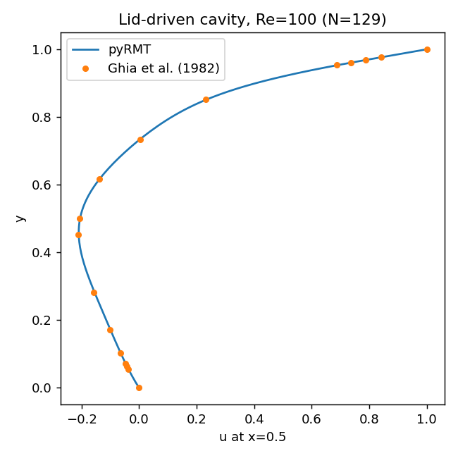
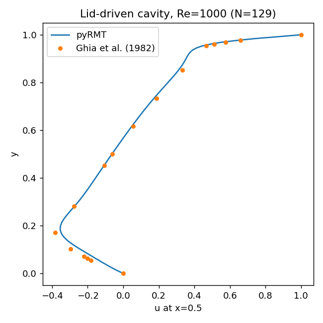
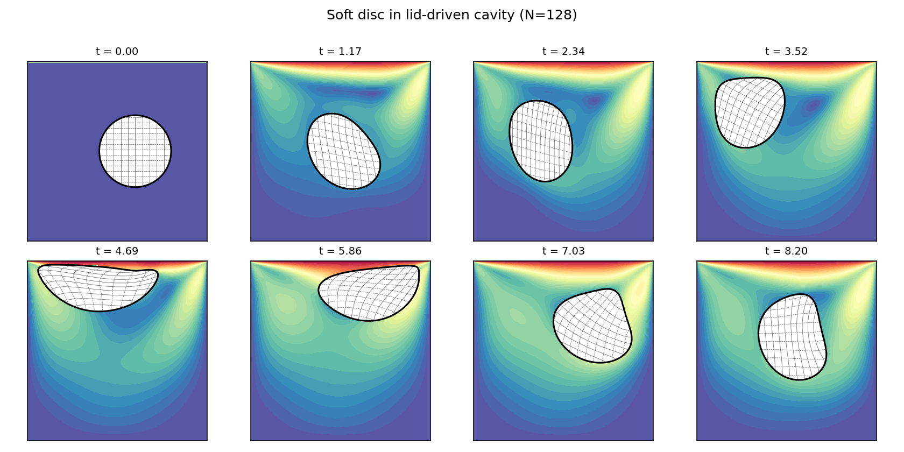
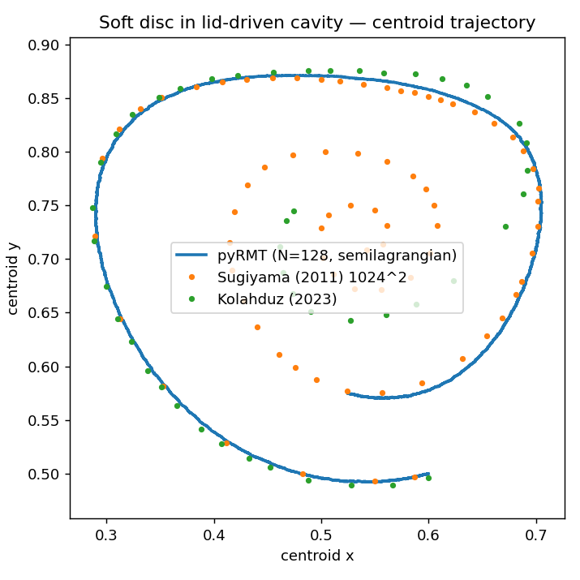
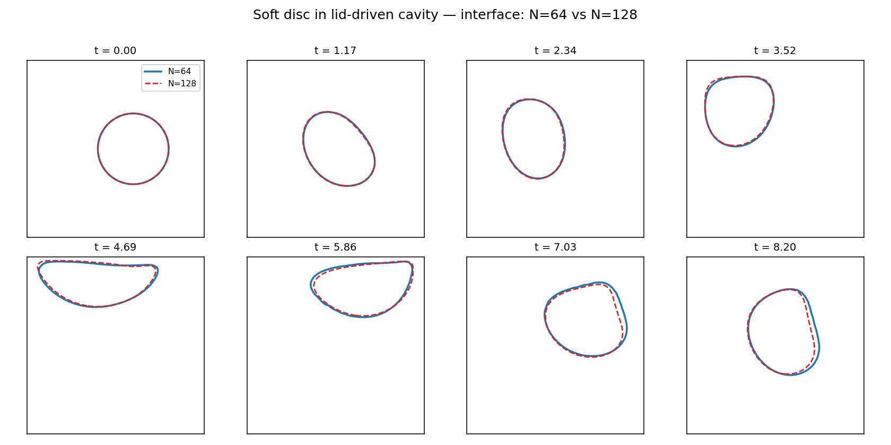
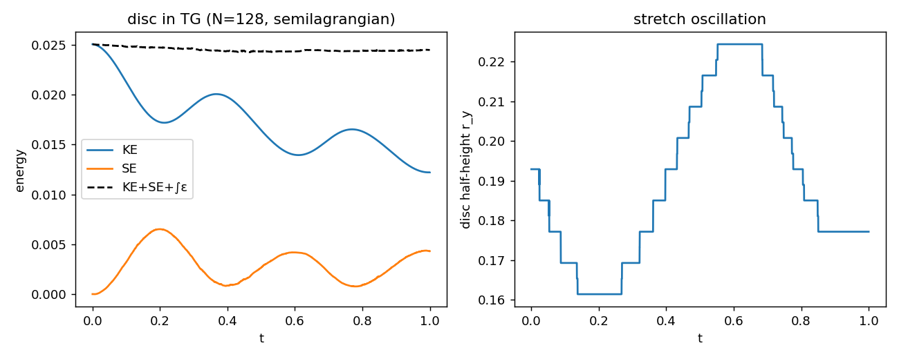
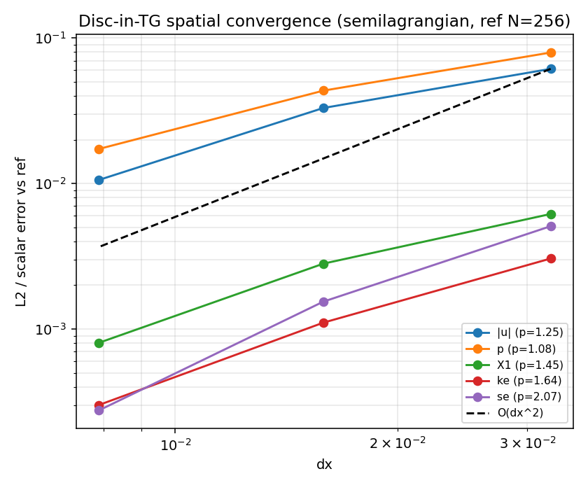

# pyRMT

A research Python code for **2D incompressible fluid–structure interaction** using
the **Reference Map Technique** (RMT): a fully Eulerian, collocated-grid,
diffuse-interface method where a neo-Hookean solid and a Newtonian fluid share one
velocity field and one pressure solve. Based on Jain, Kamrin & Mani (2019).

## Method at a glance

- **Collocated grid** with Rhie–Chow interpolation (no checkerboard).
- **Direct Poisson solvers**: DCT for walls (Neumann), FFT for periodic — both
  O(N log N); AMG fallback for variable density.
- **Switchable reference-map advection**: semi-Lagrangian RK4 (default), or
  central2 / WENO5 + SSP-RK3.
- **Neo-Hookean solid** stress from the reference map; one-fluid blending of solid
  and fluid stress through a smoothed Heaviside.
- **Least-squares extrapolation** of the reference map into a narrow band;
  level set reconstructed from the reference map.
- Numba-JIT kernels.

## Install

```bash
git clone https://github.com/samanseifi/pyRMT.git
cd pyRMT
pip install -e ".[test]"     # omit [test] if you don't need pytest
```
Requires Python 3.10+ (`numpy`, `scipy`, `matplotlib`, `h5py`, `pyamg`, `numba`).

## Quick start

```bash
# Fluid solver vs Ghia (1982)
python benchmarks/lid_driven_cavity.py 1000          # Re=1000, N=129

# Primary FSI case vs Sugiyama (2011)
python benchmarks/soft_disc_in_lid_driven.py 128 semilagrangian 8.0

# Soft disc in a Taylor–Green vortex (energy)
python benchmarks/disc_in_taylor_green.py 128

# Spatial convergence study
python benchmarks/convergence_taylor_green.py
```
Outputs (CSV + figures) land under `outputs/`. See [`benchmarks/README.md`](benchmarks/README.md)
for BC/pressure pairings, the `stress_band` accuracy/order tradeoff, and the
convergence findings.

## Results

**Lid-driven cavity (pure fluid) vs Ghia et al. (1982)** — RMS error in `u(y)` at
x=0.5: **1.7×10⁻³** (Re=100), **2.8×10⁻²** (Re=1000), N=129.

<p align="center">
 
</p>

**Soft disc in lid-driven cavity** — neo-Hookean disc carried by the cavity flow,
at the Jain (2019) Fig. 16 time instances; centroid matches Sugiyama (2011), and
the deformed interface is grid-converged (N=64 ≈ N=128).

<p align="center">

</p>
<p align="center">
 
</p>

**Soft disc in a Taylor–Green vortex** — kinetic ↔ strain energy exchange
(oscillation); total energy conserved.

<p align="center">

</p>

**Spatial convergence (disc in TG)** — energies ~2nd order; velocity/pressure
~1st order, limited by the diffuse interface (not advection). Details in
[`benchmarks/README.md`](benchmarks/README.md).

<p align="center">

</p>

## Tests

```bash
pytest            # 19 unit tests (operators, Poisson, projection, stress, energy)
```
CI runs the suite on Python 3.10/3.11 via GitHub Actions.

## License

MIT.

## References

1. S. S. Jain, K. Kamrin, A. Mani, *A conservative and non-dissipative Eulerian
   formulation for the simulation of soft solids in fluids*, J. Comput. Phys. **399**,
   108922 (2019). [doi:10.1016/j.jcp.2019.108922](https://doi.org/10.1016/j.jcp.2019.108922)
2. K. Kamrin, C. H. Rycroft, J.-C. Nave, *Reference map technique for finite-strain
   elasticity and fluid–solid interaction*, JMPS **60**, 1952–1969 (2012).
   [doi:10.1016/j.jmps.2012.06.003](https://doi.org/10.1016/j.jmps.2012.06.003)
3. B. Valkov, C. H. Rycroft, K. Kamrin, *Eulerian method for multiphase interactions
   of soft solid bodies in fluids*, J. Appl. Mech. **82**, 041011 (2015).
   [doi:10.1115/1.4029765](https://doi.org/10.1115/1.4029765)
